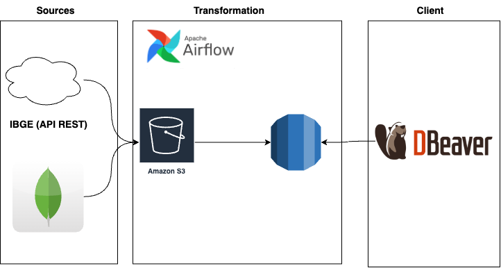

# Engenharia de dados

## Case AWS

Você foi contratado pela empresa x para desenvolver o seu primeiro projeto de Dados. Em seu trabalho investigativo preliminar, você já identificou que as principais fontes de dados necessárias são:
 - Uma Database MongoDB disponível na nuvem para consulta.
 - Uma API do IBGE (https://servicodados.ibge.gov.br/api/docs/localidades) para extração de informação de regiões, mesorregiões e microrregiões no Brasil.

Você deve, portanto, construir um pipeline de dados que faça a extração dos dados no MongoDB e na API do IBGE e deposite no Data Lake da empresa.
Após a ingestão dos dados no Data Lake, você deve disponibilizar o dado tratado e filtrado apenas para o público de interesse da empresa em um DW.
Com os dados no DW, você vai realizar algumas consultas e extrair resultados importantes para a X.

O desafio pode ser resumido na seguinte imagem:

